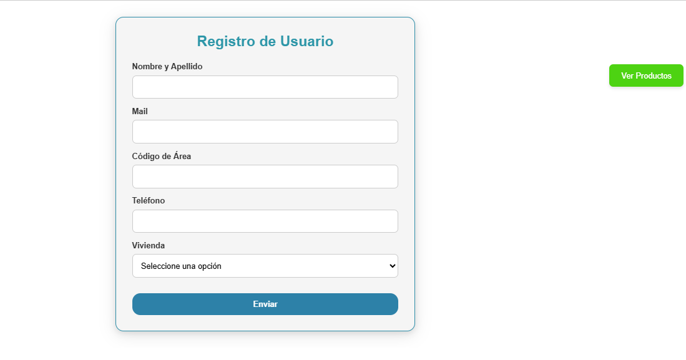
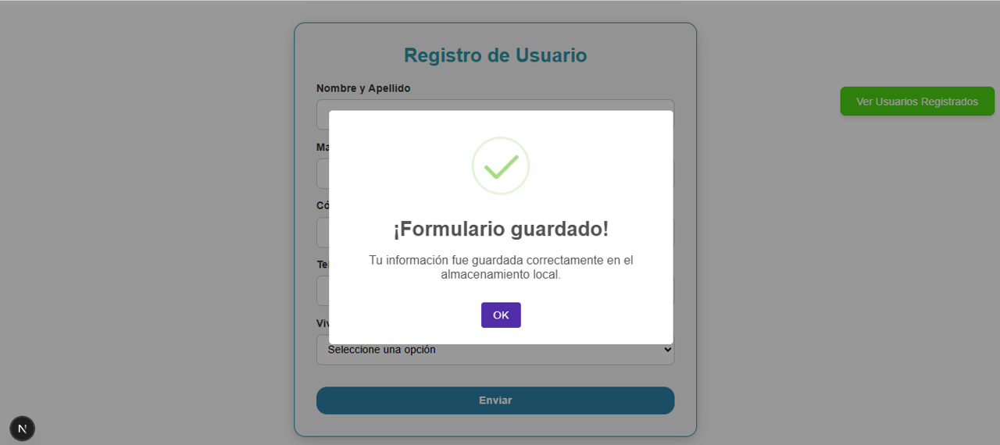
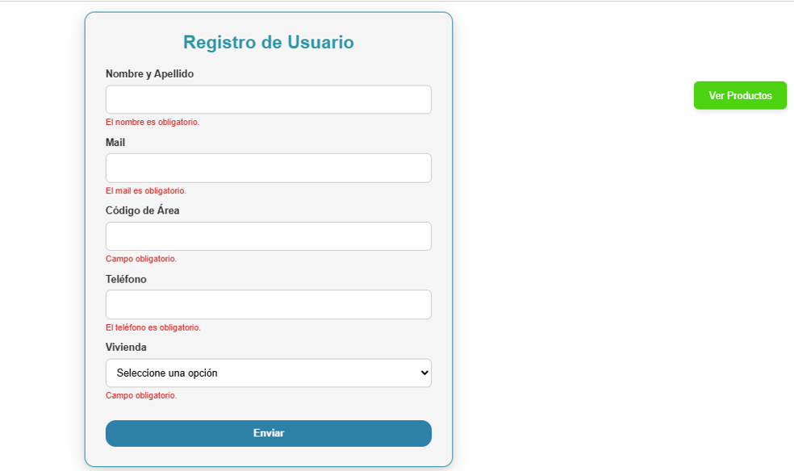
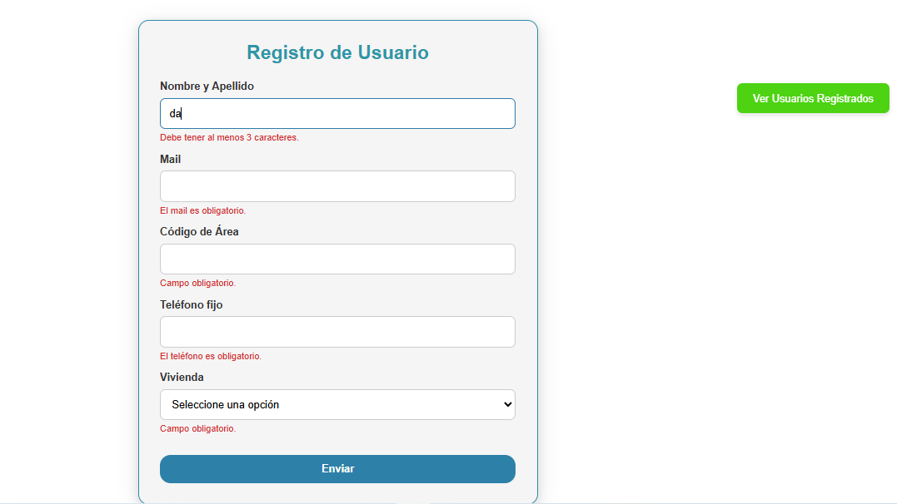
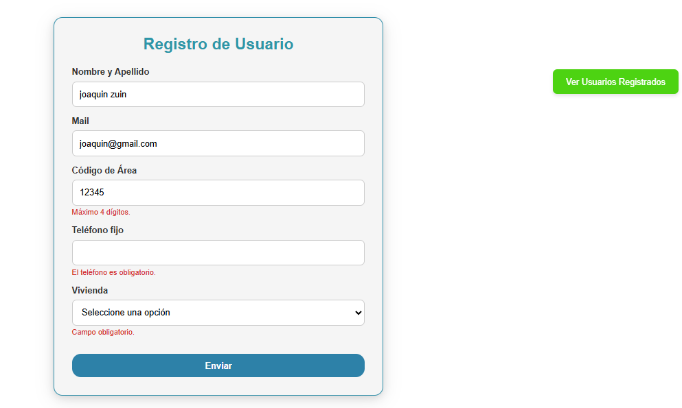
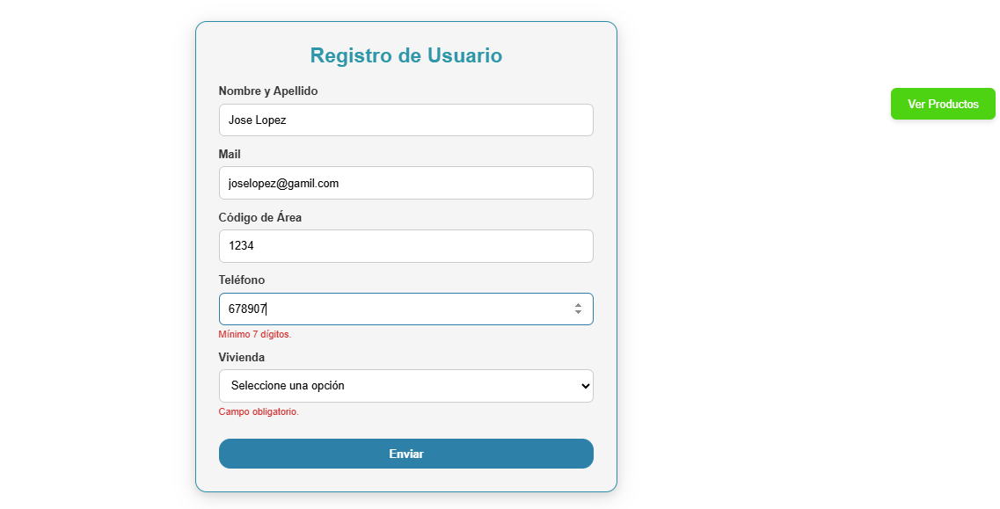
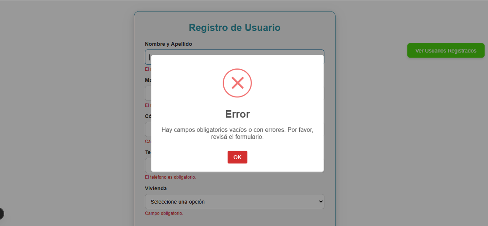
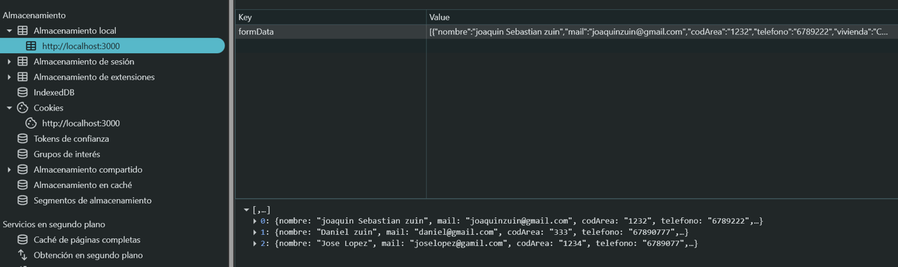
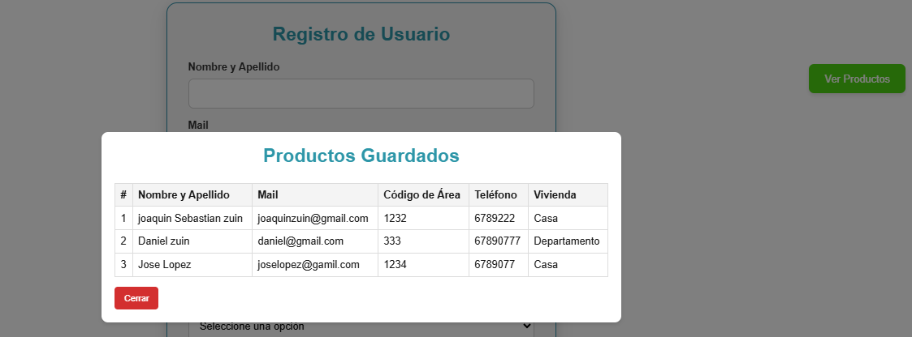

## Prueba Técnica TANDEM DIGITAL

### Joaquín Sebastián Zuin

---

## 🧪 Proyecto - Generador de Formulario Dinámico con Validaciones Avanzadas

Este proyecto consiste en una aplicación web desarrollada con **Next.js** y **React**, que genera un formulario dinámico a partir de un archivo de configuración (`formConfig.json`). Los campos incluyen texto, números y selección desplegable, y cuentan con validaciones personalizadas implementadas con `react-hook-form`.

---
## ⚙️ Instalación
Luego de clonar el repositorio, debe instalar la aplicacion mediante "npm install" e iniciarla con "npm run dev". Se abrira el navegador http://localhost:3000 para su visualizacion.

## 🧩 Tecnologías Utilizadas

- ⚛️ React
- ⏩ Next.js
- 🟦 TypeScript
- 🎨 CSS Modules
- ✅ react-hook-form
- 🔔 sweetalert2

---

## 📋 Funcionalidades

- Renderizado dinámico de campos desde archivo JSON.
- Validaciones en tiempo real de campos requeridos.
- Mensajes de error personalizados para cada campo.
- Estilos modernos, claros y responsivos.
- Alertas visuales con `SweetAlert2` para éxito o error.
- Componentes reutilizables: `TextField`, `NumberField`, `SelectField`.
- Lógica desacoplada de la presentación.
- 📦 Almacenamiento local (`localStorage`) de los datos ingresados.
- 🪟 Modal para visualizar los datos guardados.
- 📊 Tabla que lista los datos almacenados.

---

## 🚀 Uso de la Aplicación

### Inicio
- El sistema carga la pantalla principal con el formulario dinámico:

### Envío Exitoso
- Al completar correctamente los campos, se muestra una alerta de éxito:

### Validación de Errores
- Si hay campos vacíos o mal completados, se muestran alertas y errores:

### Almacenamiento y Visualización
- Una vez enviados, los datos se guardan en `localStorage`:

- Luego, se pueden visualizar en una tabla:

---
